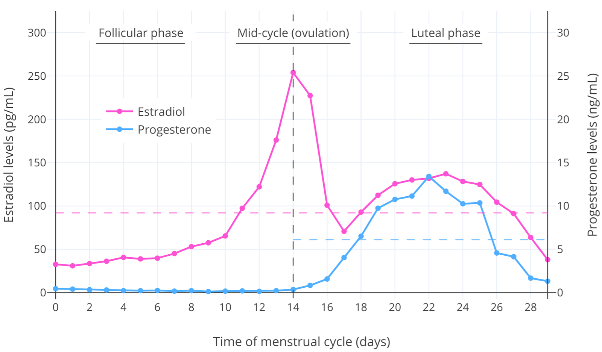
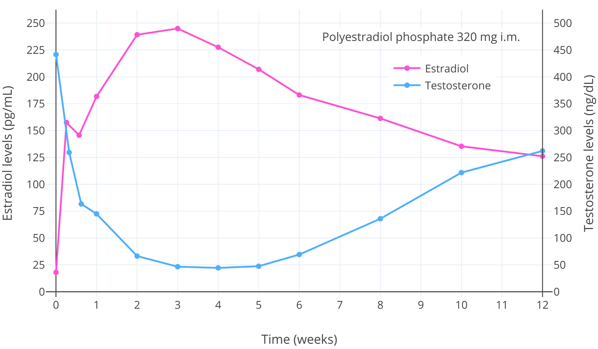

# Part 0 HRT 介绍与基本

## 跨性别激素代替疗法 (Transfem HRT)

跨性别 HRT 的目的是为了女性化以及去男性化来缓解性别焦虑症 (gender dysphoria).
为跨性别女性提供性激素药物、孕激素类药物、抗雄激素药物等来取代体内原有的激素，把体内的激素转换成女性的激素水平状态.

文献中通常推荐的激素水平为雌二醇(E2)——100–200 pg/mL；睾酮(T)——低于 50 ng/dL ([Wiki-Table](https://en.wikipedia.org/wiki/Template:Target_ranges_for_hormone_levels_in_hormone_therapy_for_transgender_women)).
但是，较高的 E2 水平可以有效地抑制睾酮.测量激素水平可以使用血液检查.血液检查是为了达到目标激素水平非常有用的方法.

## 性激素 —— 种类、作用

性激素有三种，分别为: [雌激素 (E)]{.pink}、[孕激素 (P)]{.yellow}、[雄激素]{.blue}.决定个人体内主要激素差异是与生俱来的性腺类型.男性拥有睾丸，而女性拥有卵巢.睾丸分泌大量的雄激素以及少量的雌激素，卵巢则分泌大量的雌激素和孕激素以及少量的雄激素.体内主要的雌激素—雌二醇 (E2)；孕激素—黄体酮 (P4)；雄激素—睾酮 (T)、双氢睾酮 (DHT).

性激素负责形成第二性征.它们通过作为细胞内受体的激动剂来介导其效果作用.这些受体包括——雄激素受体 (AR)、雌激素受体 (ERs)、孕酮受体 (PRs).被激活后，这些受体调控基因表达来影响细胞与组织.

雌激素(E)导致女性化，这包括: 乳房发育、皮肤柔化、女性脂肪分布 (集中在胸部、臀部、大腿)、盆骨变宽 (在骨骼发育完成前) 等. {.pink}

孕激素(P)则在女性化或青春期乳房 发育上基本不起到作用. P 不作为女性化的中介，而是在女性生殖系 统上起到重要作用，并且是 怀孕期间必要的激素.同时，P 也拮抗雌激素 (E)在身体某些部位的作用，如: 子宫、阴道、乳房. {.yellow}

雄激素导致男性化，这包括: 阴茎成长、肩部扩大、肋骨扩展、肌肉生长、声音变低沉、男性脂肪分布 (集中在腹部、腰部) 、胡须与体毛生长等.雄激素同时也会导致各种不良的皮肤与 头发作用，包括: 油性皮肤、痤 疮、脂溢性皮炎、油脂性脱 发、体臭等.同时，雄激素也拮抗雌激素可㐀成的乳房发育. {.blue}

除了对人体有影响外，性激素在 脑内也起到作用.这些作用影响认知、情感、举止等.雄激素会在男性中 产生明显的性欲、性唤起 (包括自发性勃起 ) ；而雌激素则负责产生女性的性欲 ([Cappelletti & Wallen, 2016](https://doi.org/10.1016/j.yhbeh.2015.11.003)).性激素也对健康方面有着重要的正面与 负面作用.例如雌激素保持骨骼强度，并也可能预防心脏疾病，但同时也会提高乳癌风险.

雌激素(E)、孕激素(P)以及雄激素有抗促性腺激素作用. 也就是说，它们能抑制促性腺激素 释放激素(GnRH)所引起的促性腺激素(gonadotropins)——促黄体生成素(LH)、促卵泡激素(FSH)从脑下垂体分泌.促性腺激素(LH,FSH)对性腺发出信号，使性腺分泌性激素来提供精子或卵 细胞来为生育做准备.因此，低量的促性腺激素会 导致性腺的性激素分泌减少，从而导致生育能力下降.如果促性腺激素(LH,FSH)得到充分的抑制，性腺将会停止分泌一切性激素并且生育能力将会停止.人体大量的雌二醇 (E2)、睾酮(T)、黄体酮(P4)都是由性腺生产的，而少量残留的大部分都是由 肾脏顶部的肾上腺(adrenal glands)生产的.

## 性激素 —— 正常水平

Graph: 绝经前女性的雌二醇和黄体 酮水平中位数 ([Stricker et al., 2006](https://doi.org/10.1515/CCLM.2006.160); [Abbott, 2009](https://web.archive.org/web/20200127014925/http://www.ilexmedical.com/files/PDF/Estradiol_ARC.pdfs))

其他图表显示个体差别:
[Wiki-Graph](https://commons.wikimedia.org/wiki/File:Estradiol_levels_with_LC-MS-MS_during_the_normal_menstrual_cycle_in_women.png);
[Wiki-Graph](https://commons.wikimedia.org/wiki/File:Estradiol_levels_during_therapy_with_0.25_mg_buccal_estradiol_in_postmenopausal_women.png);
[Wiki-Graph](https://en.wikipedia.org/wiki/Template:Hormone_levels_with_estradiol_esters_by_intramuscular_injection)

<table>
 <caption>Table: 采用最顶尖技术-血液测试——激素水平范围 <a href="https://doi.org/10.1016/B978-0-323-18907-1.00154-2">(Nakamoto, 2016)</a></caption>
 <thead>
  <tr>
   <td>激素</td>
   <td>性别</td>
   <td>时间</td>
   <td>水平范围</td>
  </tr>
 </thead>
 <tbody>
  <tr>
   <td rowspan="5">雌二醇 (E2)</td>
   <td rowspan="4">女性</td>
   <td>月经周期</td>
   <td>6–373 pg/mL</td>
  </tr>
  <tr>
   <td>卵泡期</td>
   <td>6–182 pg/mL</td>
  </tr>
  <tr>
   <td>排卵期</td>
   <td>44–373 pg/mL</td>
  </tr>
  <tr>
   <td>黄体期</td>
   <td>18–219 pg/mL</td>
  </tr>
  <tr>
   <td>男性</td>
   <td>N/A</td>
   <td>≤29 pg/mL</td>
  </tr>
  <tr>
   <td rowspan="5">黄体酮 (P4)</td>
   <td rowspan="4">女性</td>
   <td>月经周期</td>
   <td>≤0.3–22 ng/mL</td>
  </tr>
  <tr>
   <td>卵泡期</td>
   <td>≤0.3 ng/mL</td>
  </tr>
  <tr>
   <td>排卵期</td>
   <td>0.1–1.5 ng/mL</td>
  </tr>
  <tr>
   <td>黄体期</td>
   <td>6.7–22 ng/mL</td>
  </tr>
  <tr>
   <td>男性</td>
   <td>N/A</td>
   <td>≤0.4 ng/mL</td>
  </tr>
  <tr>
   <td rowspan="2">睾酮 (T)</td>
   <td>女性</td>
   <td>月经周期</td>
   <td>5–45 ng/dL</td>
  </tr>
  <tr>
   <td>男性</td>
   <td>N/A</td>
   <td>250–1100 ng/dL</td>
  </tr>
 </tbody>
</table>

**女性月经周期:**

卵泡期——前半 (1—14 天)

排卵期——中期 (12—16 天~)

黄体期——后期 (14—28 天)

女性平均雌二醇水平为~100 pg/mL，而男性则为~25 pg/mL；女性平均睾酮水平为~30 ng/dL，而男性则为~600 ng/dL.根据这些数值，男性睾酮水平比女性平均 20 倍更高.接受过性腺切除术的男性，睾酮水平与女性相似 (<50 ng/dL) ([Nishiyama, 2014](https://doi.org/10.1016/j.urolonc.2013.03.007); [Itty & Getzenberg, 2020](https://doi.org/10.4103/aja.aja_139_19)).

在患有雄激素过多症状或多囊卵巢综合征(PCOS)的女性中，睾酮水平为约~60 ng/dL ([Steinberger et al., 1998](https://doi.org/10.4158/EP.4.1.1)).因此，睾酮水平即使相对于正常女性值略微较高也可能产生不良的雄激素反应/男性化. {.green}

## 性腺抑制

雌激素与雄激素在足够高量的影响下是能完全抑制性腺原有的性激素分泌的，而孕激素本身基本上则能部分的抑制性腺激素分泌.更具体地说，研究发现[雌二醇(E2)水平约 200 pg/mL 通常能抑制 90%睾酮水平 (至约 50 ng/dL)，而 E2 约 500 pg/mL 能平均抑制 95%睾酮水平 (至约 20–ng/dL)]{.blue} ([Wiki-Graphs](https://en.wikipedia.org/wiki/Template:Antigonadotropic_effects_of_estradiol)).E2 水平在 200 pg/mL 以下也发现能抑制睾酮水平，但是抑制能力较低.

[孕激素本身能够最大程度地抑制 50–70%睾酮水平 (至约 150–300 ng/dL 平均)]{.green}. 雌激素与孕激素同时使用，在抗促性腺激素作用上具有协同作 用，[雌激素与最高有效孕激素剂量的使用能达到 95%睾酮抑制 (至约 20–30 ng/dL)]{.yellow}. 因此，比起单一使用高量的孕激素或雌激素来达到睾酮抑 制目的，使用较低剂量的雌激素与孕激素的组合来达到有效的睾酮抑制是更好的选择.

Figure: 单次 320mg 聚磷酸雌二醇(PEP)注射后前列腺癌患者的雌二醇与睾酮水平 ([Stege et al., 1996](https://doi.org/10.1002%2F%28SICI%291097-0045%28199605%2928%3A5%3C307%3A%3AAID-PROS6%3E3.0.CO%3B2-8))

雌激素与孕激素的抗促性腺激素作用在跨性别 HRT 中被用于抑制性腺 来达到女性激素水平目标.但同时也必须注意，这些数值是平均数值， 个人可达到的睾酮抑制因人而异.有些人可能会需要更高或更低的激素 药物剂量来达到同等参考数值的睾酮抑制.

## HRT 效果/生理变化时间线

|               效果                | 起效时间 (Onset) | 完成时间 (Completion) |      永久性       |
| :-------------------------------: | :--------------: | :-------------------: | :---------------: |
|             乳房发育              |     2–6 个月     |        1–3 年         |       永久        |
| 脸部和躯体毛发成长速度 变慢、变细 |    3–12 个月     |         >3 年         |       可逆        |
|        停止和逆转头皮脱发         |     1–3 个月     |        1–2 年         |       可逆        |
|     皮肤柔化，油脂、痤疮减少      |     3–6 个月     |         不明          |       可逆        |
|  身体脂肪再分布 (女性脂肪 分布)   |     3–6 个月     |        2–5 年         |       可逆        |
|        肌肉质量和体力下降         |     3–6 个月     |        1–2 年         |       可逆        |
|             盆骨变宽              |       不明       |         不明          |       永久        |
|          情绪与行为变化           |       即时       |         不明          |       可逆        |
|     性欲下降，自发性勃起减少      |     1–3 个月     |       3–6 个月        |       可逆        |
|       勃起障碍，射精量减少        |     1–3 个月     |         可变          |       可逆        |
|         精子产量降低/不育         |       不明       |         >3 年         | 永久/可逆 (Mixed) |
|           睾丸体积变小            |     3–6 个月     |        2–3 年         |       不明        |
|             声音变化              |       不变       |          N/A          |        N/A        |

男女性发育期间，性激素水平在数年中逐渐增加 (这大约为>5 年时间长) (参考).在非发育期的跨性别女性中投入性激素可能导致生理变化的时间较快.

起效时间/完成时间: 存在各种因素如——遗传、饮食/营养状态、激素水平会导致个体之间的差异. {.yellow}

胡须/体毛: HRT 通常对跨性别女性的毛发量影响很小.永久性脱毛可能选择激光与电解 脱毛 (Laser hair removal ; Electrolysis). {.blue}

肌肉质量、体力下降: 根据个人运动或锻炼量可能会有很大差异. {.green}

盆骨变宽: 仅发生在尚未完成发育的年轻人中. (可能完全不会对发育完成后的人有影响) {.red}

精子产量降低/不育: 主要是高剂量雌激素的使用，才可能导致永久性不育.由抗雄激素 药物导致的生育能力受损一般上在停止药物后是可逆的. {.pink}

声音变化: 过了变声期后，声音不会因雌激素而女性化.伪声是个非常好的选择. {.blue}

## 性激素水平 —— 参考文献

### 雌激素

[Esoterix/LabCorp (2020)](https://drive.google.com/file/d/1AmUJqhstSmIrcEdqmx_hLINfQLkPqqDx/view?usp=sharing)

[Frederiksen et al. (2020).](https://doi.org/10.1210/clinem/dgz196)

[Kushnir et al. (2008)](https://doi.org/10.1309/LC03BHQ5XJPJYEKG)

[Bae et al. (2019)](https://doi.org/10.1016/j.jsbmb.2019.105409)

[Biro et al. (2014)](https://doi.org/10.1210/jc.2013-4528)

[Ankarberg-Lindgren, Dahlgren & Andersson (2018)](https://doi.org/10.1016/j.jsbmb.2018.06.005)

### 黄体酮

[Esoterix/LabCorp (2020)](Esoterix/LabCorp "2020")

[Quest Diagnostics (2007)](https://drive.google.com/file/d/1ypQ6LmdXjCsaPxm15i2VIHETrIzQqHw9/view?usp=sharing)

[Wu (2006)](https://drive.google.com/file/d/1YQ0sPeTaUbbdzD_EYRBLM-Ogs59tJNlK/view?usp=sharing)

### 雄激素

[Esoterix/LabCorp (2020)](Esoterix/LabCorp "2020")

[ARUP Laboratories](https://ltd.aruplab.com/Tests/Pub/0081056)

[Kushnir et al. (2006)](https://doi.org/10.1373/clinchem.2005.052167)

[Kushnir et al. (2010)](https://doi.org/10.1373/clinchem.2010.143222)

## 给药途径

跨性别 HRT 中使用的药物包括雌激素、孕激素、抗雄激素药物. 雌激素产生女性化并抑制睾酮. 孕激素与抗雄激素药物可以进一步的抑制或拮抗睾酮. 在某些睾酮水平非常低的跨性别女性中，特殊情况下会投入低量的雄激素. 这些药物有许多类型，也具有各自的益处与风险.

雌激素、孕激素与抗雄激素药物有多种不同的配方以及给药途径.
[给药途径会影响激素在体内的++吸收++、++分布++、++代谢++与++消除++，
从而导致在生物利用度上、血清与特定组织 中的激素水平、以及代谢产物方面上存在显著的差异.]{.yellow}
这些差异可具有在治疗上的意义.

| 给药途径 | 缩写 |                  含义                  |        形式        |
| :------: | :--: | :------------------------------------: | :----------------: |
|   口服   |  PO  |             通过嘴吞服药物             |     片剂、胶囊     |
| 舌下含服 |  SL  |    含服在舌下，通过舌下毛细血管吸收    |        片剂        |
|  颊给药  | BUC  |     贴在口腔颊，药物直接由粘膜吸收     |        片剂        |
| 透皮给药 |  TD  |              通过皮肤吸收              |  贴剂、凝胶、乳霜  |
| 直肠给药 | REC  | 将药物从肛门投入肠管，通过直肠粘膜吸收 |        栓剂        |
| 肌肉注射 |  IM  |     将药液通过注射器注入肌肉组织内     | 药液 (小瓶/安瓿瓶) |
| 皮下注射 |  SC  |           将药液注入皮下组织           | 药液 (小瓶/安瓿瓶) |
| 皮下植入 | SCi  |        通过手术切口植入皮下组织        |       Pellet       |

详细请看: (雌二醇——给药途径 篇)

## 不推荐使用的 HRT 药物例子

避免使用合成激素可以大幅地降低风险

- 炔雌醇 (Ethinylestradiol / EE) + 醋酸环丙孕酮 (CPA)

  - Diane-35 (达因 35)

- 炔雌醇 (Ethinylestradiol / EE) + 屈螺酮 (Drospirenone)

  - 优思明 (Yasmin)

- 炔雌醇 (Ethinylestradiol / EE) + 去氧孕烯 (Desogestrel)

  - 妈富隆 (Marvelon)

- 结合雌激素 (Conjugated Estrogens / CEEs)

  - 倍美力 (Premarin)

- 合成孕酮 / 黄体制剂 (Progestins)

  - 醋酸环丙孕酮 (Cyproterone Acetate / CPA) >50mg

  - 甲羟孕酮 (Medroxyprogesterone Acetate / MPA)

  - 醋酸甲地孕酮 (Megestrol Acetate / MGA)

  - 炔诺酮 (Norethindrone / NET)

  - 几乎任何合成孕激素 (Wiki-Table)

- 抗雄激素类药物 (Antiandrogens)

  - 氟他胺 (Flutamide)

- Others (其他)

  - 西咪替丁 (Cimetidine)

## 概要、重点 —— 简单化

1. 尽量避免使用任何合成激素药物 (避孕药、合成孕酮)，合成激素带来较大的风险. 只使用天然激素的 HRT 在安全上是与顺性别一样的.

2. 没有一个适用于全部人的 HRT 方法，每个人的内分泌系统反应有很大的差异.最好的 HRT 是使用血液检查后调整为个人定制的 HRT.

3. 合成雌激素，特别是炔雌醇(EE / Ethinylestradiol)，与血栓风险有很大的关系.雌二醇并没有这问题，但是口服途径的雌二醇会增加一定的血栓风险以及给肝脏带 来压力.

4. 乳房发育的因素非常大部分是被基因遗传影响的、目前没有已知的激素药物“丰胸”方法. 传闻的“孕激素会使胸部长得更大”没有科学根据.

5. 孕激素主要两种: 黄体酮 (Progesterone) 与 黄体制剂 (Progestin).这两种是有差别的，天然的黄体酮与人工合成的黄体制剂在结构上是不同的，对身体带来的副作 用与风险也不同.

6. 大家常使用的孕激素“日孕”注射剂不是天然黄体酮，而是 [OHPC](https://en.wikipedia.org/wiki/Hydroxyprogesterone_caproate) (Hydroxyprogesterone caproate).OHPC 是一种黄体制剂/Progestin (合成孕激素药物). 所以在已经使 用着 CPA (色普龙) 的前提下使用 OHPC 注射其实没有意义.孕激素不是长大胸的激素.

7. 有些人使用的“土补” (蓝盒子；含有 norgestrel 的雌二醇组合药物)，由于里面含有小剂量的黄体制剂，避免使用 CPA 高剂量或额外添加别的孕激素使用.

8. 雌二醇水平不是越高就越好的，人体不能处理超过 1000 pg/mL 的雌二醇.但是如果雌二醇和睾酮的水平太低是会造成疲倦、没力气的.人体需要一个主要的性激素 ，不能两方都低下.

9. 目标的激素水平 (全部以谷浓度为标准): {.pink}

   1. 口服雌二醇 i. E2: 100 pg/mL – 200 pg/mL
   2. 雌二醇注射 (单疗) i. E2: 300 pg/mL – 400 pg/mL
   3. 睾酮水平 i. T: 50 ng/dL 以下 {.blue}

10. [血液检查必须为谷浓度]{.yellow}(trough level).任何时间 (如: 服用雌激素后不久采取的血液) 完全不能作为一个可靠的参考数据.血液必须在服用下一份雌激素剂量前采取. (如果剂量时间是中午 12 点，最好在上午 11:00 ~ 11:59 内采血)

11. 避免使用超过每天 12.5 mg 剂量的 CPA (色普龙)，使用更高剂量并不会带来更强力的睾酮抑制. {.green}

12. 剂量不重要，重要的只是激素水平.使用血液检查来调整适合个人的剂量.

13. “注射比口服雌二醇在女性化效果上更好” —— 这说法没有任何科学根据.并没有研究能证明某些给药途径会在女性化效果上有差异，有的只是生物利用度的差 异，而这会导致体内雌二醇(E2)水平的差异.如果 E2 水平太低，那可能就是女性化作用缓慢的原因.

14. 雌二醇注射是最安全的给药方式，在健康风险上最低.

## 小常识与道具

1. [HRT 最重要的是抗雄，接下来是把激素调整到理想值.以下是理想目标值:]{.pink}

   - 睾酮 (T) 低于 <50 ng/dl
   - 雌二醇 (E2) 建议最少 >100 pg/ml (理想的 E2 值与雌二醇摄取途径有很大关联)

2. [关于促性腺激素 (Gonadotropins) 的主要两个:]{.pink}

   1. 促黄体生成素 (LH)

      与睾酮生产有关的激素

      - LH 刺激睾丸中的 Leydig 细胞合成，产生睾酮
      - <0.03mIU/mL 以下，性腺将会停止生产睾酮

   2. 促卵泡激素 (FSH)

      与精子生产有关的激素

      - FSH 在睾丸中提高 Sertoli 细胞合成雄激素结合蛋白，是在制造精子过程中起到重要作用的激素
      - <0.03mIU/mL 以下，性腺将会停止制造精子

3. [HRT 的血液检查]{.pink}

HRT 中最重要的是血液检查.除了基本的健康检验之外，由于每个人身体与内分泌系统反应有差异，血液检查对调整好药物与激素剂量来说是非常重要的.

HRT 期间的血液检查必须为[**谷浓度 (trough level)**]{.yellow} ——在服用下一份剂量前采血，检测血清激素浓度[++最低值++]{.yellow}.

此外，检查血清睾酮最理想时间段为早晨.这是因为我们体内睾酮的日变化(diurnal variation/cycle)巅峰期在 05:30 ~ 08:00 时间段.

谷浓度举例: {.yellow}

蓝: 雌激素服用时间 (12:00) {.blue}

粉: 采血时间 (11:00 ~ 12:00) {.pink}

### HRT 前血液检查项目 (Pre-labs) {.yellow}

- 肝功能试验 (Liver Function Test / LFT)
- 血常规 (全血细胞计数) (Full Blood Count / FBC / Complete Blood Count / CBC)
- 肾功能试验 (Renal Function Test / RFT)
- 雌二醇 (E2)
- 睾酮 (Testosterone)
- 甲功五项 (Thyroid Function Test / TFT)

激素计量单位转换——链接 (UnitsLab):

- [雌二醇 (E2)](http://unitslab.com/node/113)
- [睾酮 (Testosterone)](http://unitslab.com/node/136)
- [黄体酮 (P4)](http://unitslab.com/node/128)
