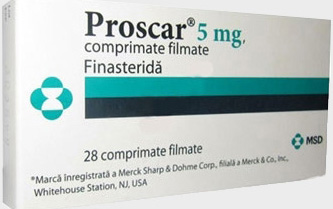
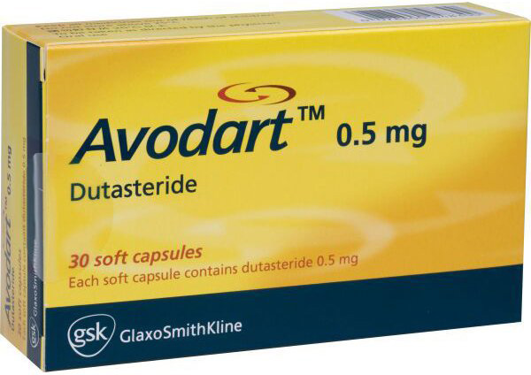
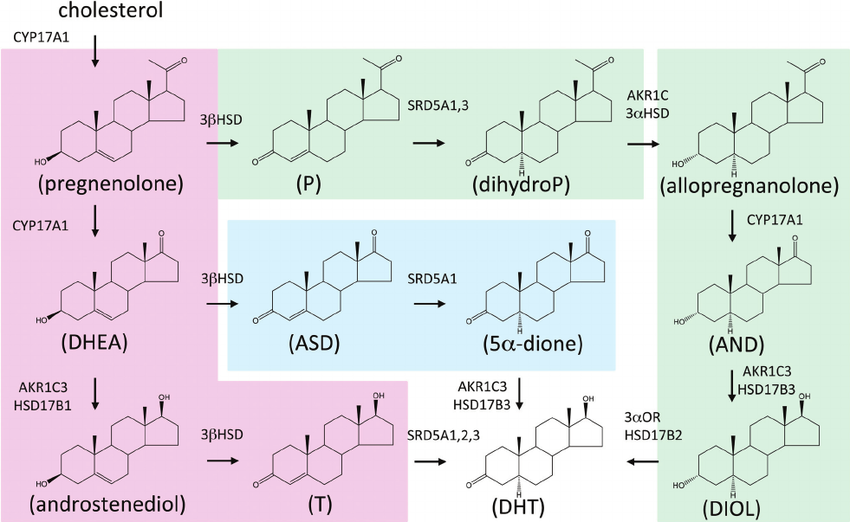
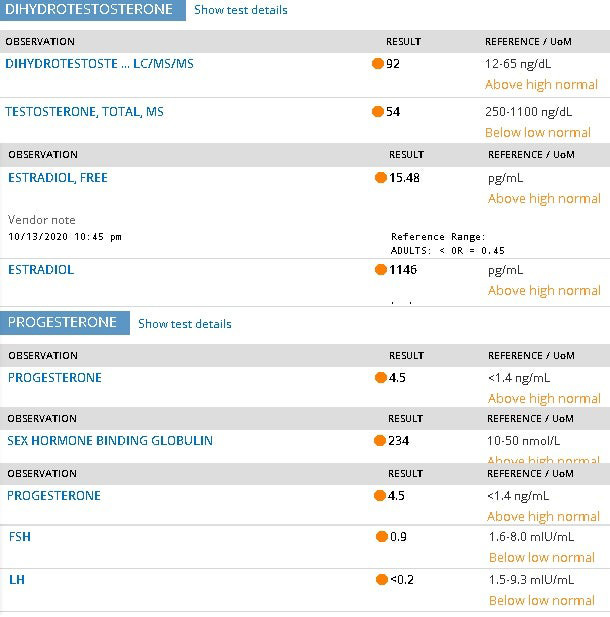

# Part 7 双氢睾酮 (DHT) 篇

## 5α-还原酶抑制剂

非那雄胺 (Finasteride)；度他雄胺 (Dutasteride)

Brand name: “Proscar”；”Avodart”

### 价格

非那: ~US$0.05 /mg 度他: ~US$0.35~0.7 /0.5mg 【价格参考来自 HRT.Cafe】

### 外国药商一列

非那: [HRT.Cafe (Finasteride)](https://hrt.cafe/finasteride/) 度他: [HRT.Cafe (Dutasteride)](https://hrt.cafe/dutasteride/)

### 介绍

双氢睾酮(DHT)是一种比睾酮更强力的雄激素，其活性比睾酮高数倍.睾酮在人体某些组织内转化为 DHT，而这转化是由 5α-还原酶所引发的 ([Swerdloff et al., 2017](https://doi.org/10.1210/er.2016-1067)).存有 5α-还原酶的组织非常有限，主要的有包括皮肤、毛囊和前列腺.尽管 DHT 比睾酮更强大，它作为循环激素的生物作用较低 ([Horton, 1992](https://doi.org/10.1002/j.1939-4640.1992.tb01621.x))，而睾酮则是主要的循环激素.

5α-还原酶抑制剂 (5α-RIs) 抑制 5α-还原酶所导致的睾酮 → DHT 转化，从而降低循环、组织中的 DHT 浓度.由于 DHT 主要是作为一个组织内的介质存在而不是循环激素 ，5α-RIs 带来的抗雄作用有限.事实中证明 5α-RIs 在男性中不会引起明显的脱男性化现象 ([Hirshburg, 2016](https://www.ncbi.nlm.nih.gov/pmc/articles/PMC5023004/)).5α-RIs 在医学上主要用于治疗雄性激素源性脱发、多毛症、前 列腺增生.由于其特异性，5α-RIs 不适合作为一般的抗雄激素药物来使用.此外，由于跨性别女性 HRT 中的雌激素使用所造成的睾酮抑制，DHT 浓度一般上会随着睾酮浓度 一同降低，所以 5α-RIs 的使用在大多数情况下是不必要的 ([Irwig, 2020)](http://doi.org/10.1111/andr.12881).但在特殊情况下，如果在跨性别女性中出现 DHT 造成的持续体毛生长或脱发 (像在少数女性中发 生的案例)，5α-RIs 可以作为有用的治疗药物使用 ([Barrionuevo et al., 2018](https://doi.org/10.1210/jc.2017-02052)).然而在这方面上，有更好的证据表示 AR 拮抗剂更加适合这治疗 ([van Zuuren et al., 2015](https://doi.org/10.1002/14651858.CD010334.pub2))，因为 AR 拮抗剂能同时拮抗睾酮与 DHT 而 5α-RIs 只能抑制 5α-还原酶所转化的 DHT.

非那雄胺、度他雄胺的区别 5α-还原酶有三种同功酶，分别为 SRD5A1 (I 型) 、SRD5A2 (II 型) 、SRD5A3 (III 型) .度他雄胺能抑制全三个亚型，而非那雄胺只能抑制 I 型与 II 型.由于这原因，度他雄 胺是比非那雄胺更完全的 5α-RIs. 度他雄胺可有效降低 98%的血清 DHT 水平；而非那雄胺只能降低 65–70%. 各种研究发现度他雄胺在治疗男性脱发中是比非那雄胺更有效的 5α-RIs ([Zhou et al., 2018](https://doi.org/10.2147/CIA.S192435); [Dhurat et al., 2020](https://doi.org/10.1111/dth.13379)).

5α-RIs 的副作用

- 一个有可能发生的副作用是 5α-RIs 的使用可能会在没有任何睾酮抑制的情况下导致睾酮水平上升 ([Leinung et al., 2018](https://doi.org/10.1089/trgh.2017.0035); [Traish et al., 2019](https://doi.org/10.1016/j.sxmr.2018.06.002); Irwig, 2020).似乎在睾 酮水平较低且拥有睾丸的男性上，DHT 增加了垂体上促性腺激素分泌的负反馈.这对于跨性别女性在 HRT 上的影响还不明.
- 另外一个潜在的不良作用是 5α-RIs 除了抑制 5α-还原酶的 DHT 转化，也抑制了某些神经甾体.神经甾体是在神经组织中的甾体激素——主要是大脑.5α-RIs 抑制的 神经甾体包括: 黄体酮的代谢产物——四氢孕酮 (allopregnanolone)，睾酮与 DHT 的代谢产物——雄烷二醇 (3α-androstanediol). 研究发现这些神经甾体有对情绪、焦虑、压力、和其他认知/情绪中有一定的生物调节作用 ([King, 2013](https://doi.org/10.1007/978-1-4614-5559-2_1)).同时这也可能与少数抑郁等风险有关 ([Welk et al.,2018](https://doi.org/10.1001/jamainternmed.2017.0089); [Deng et al., 2020](https://doi.org/10.22037/uj.v16i7.5866); [Dyson, Cantrell, & Lund, 2020](https://doi.org/10.1097/JU.0000000000001079); [Nguyen et al., 2020](http://doi.org/10.1001/jamadermatol.2020.3385); [Wiki](https://en.wikipedia.org/wiki/5%CE%B1-Reductase_inhibitor#Emotional_changes))

### 推荐剂量

➢ 度他雄胺 —— 口服: 0.5mg/天

➢ 非那雄胺 —— 口服: 0.25 ~ 5mg/天

## DHT 的合成途径

以下会非常粗略的讲解一下 DHT 合成问题，以后如果有机会可能会对这 DHT 有关主题做个完整且深入的资料...

5α-还原酶抑制剂(5α-RIs)虽然有时候被称为 DHT 抑制剂，但事实上并不是.在大多数情况下，由于 DHT 是睾酮的代谢产物 (睾酮 -> DHT 合成 )，而这个合成过程是 5α 还原酶导致的，使用 5α-RI 确实是可以抑制此合成途径并降低 DHT 浓度.但是在非常罕见的情况下，DHT 可以不通过此途径，而是从其他两个已知的合成途径产生.如 果是从其他两个途径合成的 DHT，非那雄胺或度他雄胺这种 5α-RIs 是对 DHT 抑制没效的.如果是肾上腺 DHEA-S 导致的 DHT 合成，这应该是目前最难治疗的情况，目前 据作者我所知只能使用 —— ([Abiraterone acetate](https://en.wikipedia.org/wiki/Abiraterone_acetate)).但这种 DHT 异常问题在跨性别女性中可能是非常罕见的，估计为少于 4%.

DHT 的 3 个来源途径为:

- 普通途径 (5α-还原酶) 睾酮 (T) → DHT {.pink}
- 前门途径 DHEA-S → DHT {.blue}
- 后门途径 黄体酮 (P) → DHT {.green}

## DHT 异常 —— 例子

一般上被认为接受过“睾丸切除术或 SRS”后的跨性别女性是完全不需要担心雄激 素问题的，但这个认识是不正确的.在可能性上是完全有可能在术后还是会因为 雄激素的影响造成男性化症状的.术后的女性一般上不用担心睾酮问题，但是在 非常罕见的情况下，非常少数的人可能会拥有高水平 DHT 问题.

如果在术后，或是在使用高剂量雌激素、使用抗雄激素 (如: CPA) 来抑制睾酮的 情况下 DHT 水平还是非常高，可以尝试使用比卡鲁胺和/或 5α-RIs.CPA 在这种异 常 DHT 合成问题上是完全没用的；而螺内酯由于其 AR 拮抗作用太弱，是无法有效 拮抗大量 DHT 的. 而且如果 DHT 的来源不是 5α-还原酶合成，5α-RIs 也是没用的.

右图是来自一名接受过 SRS (性别重置手术) 后的跨性别女性.她由于感到身上的雄 激素反应所以把雌二醇剂量调高，因此 E2 水平为 1146 pg/mL.尽管这名女性的 E2 水平 非常高，睾酮也是还属于女性值范围的情况下，DHT 水平异常的高.这名术后跨性别 女性拥有的 DHT 水平比一般持有睾丸的男性还更高.

DHT 标准水平:

- [Esoterix/LabCorp (2020)](https://drive.google.com/file/d/1AmUJqhstSmIrcEdqmx_hLINfQLkPqqDx/view?usp=sharing) — HPLC-MS/MS
  - 成年男性 —— 30–80 ng/dL
  - 成年女性 —— 4–22 ng/dL
- [Nakamoto (2016)](https://doi.org/10.1016/B978-0-323-18907-1.00154-2) — LC-MS/MS
  - 成年男性 —— 16–79 ng/dL
  - 成年女性 —— 5–46 ng/dL
